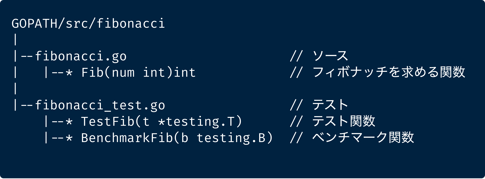

# mixleap-go-test-fibonacci

---

## Overview

**Mix Leap Study #44 - Go言語 ハンズオン** で作成する Fibonacci のリポジトリです。

* https://yahoo-osaka.connpass.com/event/131379/

## Presentation

[ 発表資料 ]
* https://speakerdeck.com/shinsakuyagi/mix-leap-go-hands-on

[ 補足用 ]
* https://speakerdeck.com/shinsakuyagi/mix-leap-go-hands-onfalsebu-zu-yong-suraidodesu

## Goのインストール

### Mac/Linux

* https://golang.org/dl/
* 環境にあったインストーラをダウンロードしてインストール

### Windows

* https://qiita.com/yoskeoka/items/0dcc62a07bf5eb48dc4b
* 忘れがちな `環境変数を編集` を忘れないように

## Agenda

### 1. 環境の確認する

```
go version
```

### 2. GOPATH の確認

```
go env GOPATH
```

### 3. GOPATH へ移動

`go env` で取得した `GOPATH` をクリップボードにコピー。

```
cd ここにPathをペースト # (例) cd /Users/sy/go
```

### 4. 作業用ディレクトリ作成

```
mkdir fibonacci
```

ディレクトリは以下のようになります。



### 5. 作業用ディレクトリを VS Code で開く

* ファイル -> 開く -> 先程作ったディレクトリ(fibonacci)を選択

### 6. Let's Hands-on!

* 当日はライブコーディング形式でのハンズオンを実施します
* どうしてもわからなければ、完成したものが `complete` に、途中まで作っているものが `skeleton` にそれぞれ入っているので参考にしてください

ハンズオンで使用するコマンド例


### 7. 時間が余ればパフォーマンスについてもう少しだけ話します

* 興味があれば `performance_tuning` の中を覗いてみてください
